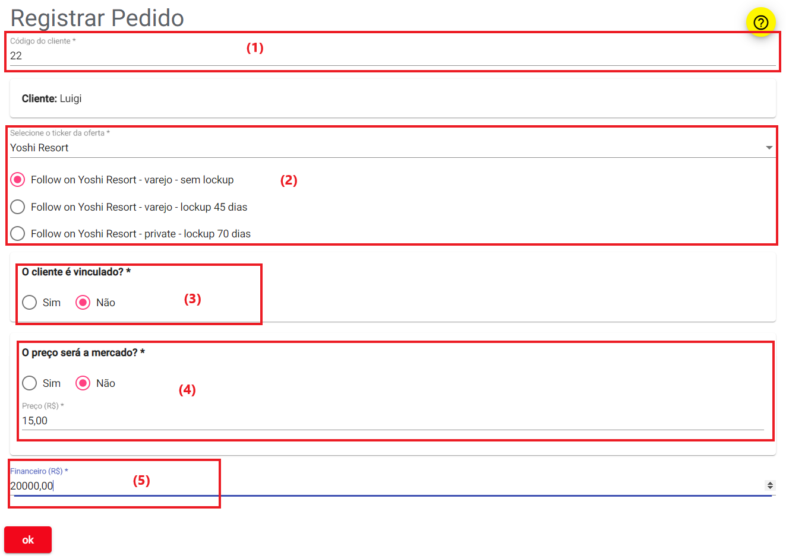
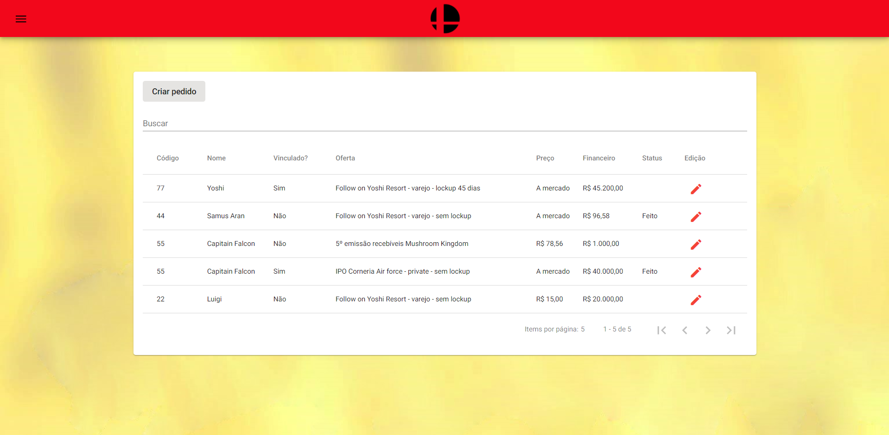
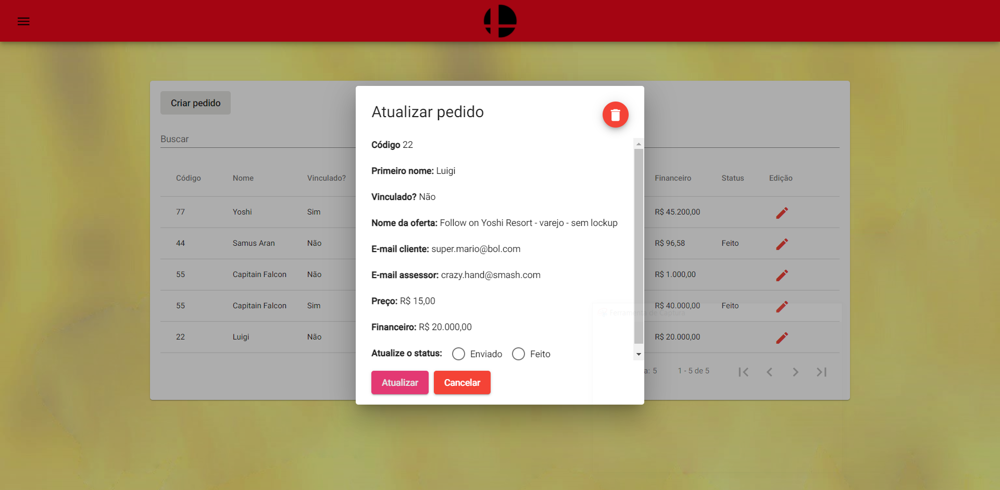
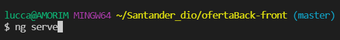
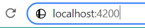

# Frontend-PublicOffer-testmode :flags:

### Início

Fala pessoal, esta é a parte frontend da elaboração de um sistema que irá gerenciar ordens de ofertas públicas de ativos financeiros.

Vocês podem ver a parte backend por meio deste link: https://github.com/Amorim-cyber/Backend-PublicOffer-testmode

A oferta pública é basicamente uma proposta de negócio, e existem vários tipos. Contudo não vou me estender a tecnicalidades, aqui neste projeto irei falar apenas das mais conhecidas: o IPO e o FOLLOW ON

Sendo bem breve IPO (*Initial Public Offering*)  é um tipo de oferta pública na qual as ações de uma empresa geralmente são vendidas a investidores institucionais, os quais, por sua vez, vendem essas ações ao público em geral, em bolsa de valores pela primeira vez.

O follow on é uma oferta subsequentes de uma empresa que já abriu seu capital.

Portanto, a motivação desse projeto é criar um controle para essas reservas.

### TECHS UTILIZADAS

* Angular
* Angular Material
* IDE Visual Studio Code (ou outra opção se preferir)

### Modelo de negócios

Aqui no nosso projeto vamos entrar na pele da instituição financeira **Smash Banking** que reservou ações de várias empresa fictícias podendo participar de suas ofertas públicas.

Os colaboradores Master Hand e Crazy Hand estão responsáveis pela assessoria financeira. Eles são os intermediários entre cliente e instituição.  

Vamos supor que o cliente Luigi quer participar do IPO de Yoshi Resort e solicita à Crazy Hand, seu assessor, reserva. 

Crazy Hand pega mais informações sobre o pedido e registra os seguintes dados ao sistema:

</img>

Analise dos pontos em vermelho:

1. Primeiro o assessor digitou o código de cliente do Luigi para encontra-lo no sistema.
2. Cliente deseja participar do follow on de Yoshi Resort, uma empresa já negociada, e optar por ser do tipo varejo sem lockup. Varejo pois será um pedido abaixo de R$ 1.000.000,00 e sem lockup dá o direito ao Luigi vender a ação a qualquer momento após ser adquirida.
3. Luigi não trabalha na Yoshi Resort, logo ele não tem vinculo com a empresa.
4. Luigi opta em escolher o preço a R$ 15,00 por ação invés de adquiri-la ao preço que será estipulado no bookbuilding.
5. Por fim ele deseja colocar o valor de R$ 20.000,00 na oferta.

Clicado ok, o pedido é registado no sistema e ele passa para uma lista de monitoramento junto com outros clientes do Smash Banking, por lá uma equipe interna irá atuar em cada pedido.

</img>

Na parte de edição a equipe pode visualizar mais dados sobre o pedido, atualizar o seu status e até deletar o pedido.

O pedido pode estar em dois tipos de status:

* **Enviado:** Pedido foi para a central ser processado.
* **Feito:** Central informa a equipe que o pedido foi realizado com sucesso.

</img>

### Como instalar o programa

Para rodar o projeto localmente em sua maquina siga os seguintes passos:

1. Baixe os arquivos deste repositório

2. Execute o comando `ng serve` em seu terminal dentro do diretório deste projeto

   </img>

3. Digite `http://localhost:4200`  no seu navegador.

   </img>

**PRONTO**

A aplicação está pronta para uso.

</img>

### Considerações finais

Pode ser que o programa trave por ainda estar tentando conectar ao banco. Caso isso ocorra espere alguns instantes ou dê refresh na página.

### FORTE ABRAÇO!! :smile:

